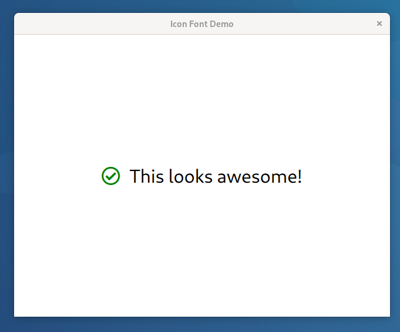

SVG to TTF conversion
=====================
 [](https://opensource.org/licenses/MIT)

In some cases you've got the task to integrate lots of icons into your application. All
these icons need to be scaleable to play well with high DPI displays, and should be
colorizable on demand (e.g. when a state changes or an interaction shall be visualized).

Putting all these icons in your application using SVGs might be the first option that
comes to mind, but it turns out that the rendering perfomance may suffer in some cases
and that including icons by SVG increases the size of your application dramatically. That's
the point where (icon) fonts can be used:

 * scaleable (no need for multiple bitmap icons in various sizes)
 * rendering quickly as text glyphs
 * colorizable by just setting the text color
 * smaller in size (e.g. ~800 icons, SVGs 3.2M, TTF 0.2M)

Using fonts may not be applicable in all cases, because there are also drawbacks:

 * only monochrome (at least for a standard font out of the box)
 * SVGs may need some extra love (i.e. we'd recommend only using a single *path* in them)
 * font editors are a bit special for people not comfortable with them

`svg-to-ttf` is a small utility script that helps creating icon fonts to be used
in *C++*-based applications. It crawls through a given directory and collects all SVGs, puts
them in a TTF file and maintains a map where the font's character index is looked up by
passing in the original SVG path.


Installation
============

As it needs fontawesome and its python bindings, we recommend using the pre-built *docker*
image. All you need is `docker`/`podman` and access to *docker hub*. On a Unix style system,
you can install the wrapper script like this:

```sh
curl https://raw.githubusercontent.com/gonicus/svg-to-ttf/master/svg-to-ttf --output svg-to-ttf
chmod +x svg-to-ttf
mv svg-to-ttf ~/.local/bin
hash -r
```

Move *svg-to-ttf* to a directory in `PATH` of your choice (e.g. `~/.local/bin`). Test it for
the first time and let *docker* pull some layers first:

```sh
svg-to-ttf --help
```

```
usage: svg-to-ttf [-h] [--font-name FONT_NAME] [--copyright COPYRIGHT] [--output OUTPUT] [--strip-bounding-rect] [--qt] [--qml-namespace QML_NAMESPACE] [--qml-element QML_ELEMENT] source

positional arguments:
  source

optional arguments:
  -h, --help            show this help message and exit
  --font-name FONT_NAME
                        name of the generated font
  --copyright COPYRIGHT
                        copyright notice placed inside the generated TTF file
  --output OUTPUT       path where generated files are placed
  --strip-bounding-rect
                        path where generated files are placed
  --qt                  whether to build Qt/QML style output files
  --qml-namespace QML_NAMESPACE
                        name of the QML namespace used in your .pro file
  --qml-element QML_ELEMENT
                        name of the QML icon element for this font

```


From source
-----------

Alternatively you may want to run it from source. Just run the python script in the src directory directly and make
sure that you have these installed:

 * Python 3
 * Beautifulsoup 4
 * Fontforge bindings for Python 3


Example with Qt/QML
===================

Lets do a simple Qt/QML (≥5.15) application that includes a couple of [Font-Awesome](https://github.com/FortAwesome/Font-Awesome)
icons. They're available as a TTF already, but they include the source SVGs, so that we've something to play around.

As a first step, let's create a project directory and change into it:

```sh
mkdir demo
cd demo
```

Download a bunch of SVGs for demo purposes:

```sh
curl -L https://github.com/FortAwesome/Font-Awesome/archive/5.15.0.tar.gz | tar xvz --strip-components=2 Font-Awesome-5.15.0/svgs/regular
```

Build a font from it that is suitable to be used in a Qt/QML project:

```sh
svg-to-ttf --qml-namespace Demo --qt regular
```

If everything works fine, it should output:

```
✓ ./IconFont.ttf has been generated
✓ ./IconFont.h has been generated
✓ ./IconFont.cpp has been generated
✓ ./Icon.qml has been generated
```

Ok. We've got a TTF font now, a simple IconFontResolver class, which basically stores the *file-to-index* mapping and a
new QML element called `Icon`. Let's build a *qmake* based project around it:

Project file
------------

Create a file named `demo.pro` with the following content:

```qmake
!versionAtLeast(QT_VERSION, 5.15):error("Use at least Qt version 5.15")

QT += quick gui

CONFIG += c++11 qmltypes

SOURCES += \
        IconFont.cpp \
        main.cpp

RESOURCES += qml.qrc

# Additional import path used to resolve QML modules in Qt Creator's code model
QML_IMPORT_PATH =

# Additional import path used to resolve QML modules just for Qt Quick Designer
QML_DESIGNER_IMPORT_PATH =

QML_IMPORT_NAME = Demo
QML_IMPORT_MAJOR_VERSION = 1

# Default rules for deployment.
qnx: target.path = /tmp/$${TARGET}/bin
else: unix:!android: target.path = /opt/$${TARGET}/bin
!isEmpty(target.path): INSTALLS += target

HEADERS += \
    IconFont.h
```

Please note that `QML_IMPORT_NAME` needs to conform to the `--qml-namespace Demo` option from above.

Application boilerplate
-----------------------

Create the `main.cpp`:

```cpp
#include <QGuiApplication>
#include <QQmlApplicationEngine>

int main(int argc, char *argv[])
{
    QCoreApplication::setAttribute(Qt::AA_EnableHighDpiScaling);

    QGuiApplication app(argc, argv);

    QQmlApplicationEngine engine;
    const QUrl url(QStringLiteral("qrc:/main.qml"));
    QObject::connect(&engine, &QQmlApplicationEngine::objectCreated,
                     &app, [url](QObject *obj, const QUrl &objUrl) {
        if (!obj && url == objUrl)
            QCoreApplication::exit(-1);
    }, Qt::QueuedConnection);
    engine.load(url);

    return app.exec();
}
```

Main view
---------

Create the main QML demo file referenced from `main.cpp`, called `main.qml`:

```qml
import QtQuick 2.15
import QtQuick.Window 2.15

Window {
    width: 640
    height: 480
    visible: true
    title: qsTr('Icon Font Demo')

    Row {
        anchors.centerIn: parent
        height: Math.max(demoIcon.height, demoLabel.height)
        spacing: 16

        Icon {
            id: demoIcon
            iconPath: 'check-circle'
            size: 32
            color: 'green'
            anchors.verticalCenter: parent.verticalCenter
        }

        Text {
            id: demoLabel
            font.pixelSize: 32
            text: qsTr('This looks awesome!')
            anchors.verticalCenter: parent.verticalCenter
        }
    }
}

```

This creates a centered atom (a pair of icon and text) with a green image and normal styled text.

Build the demo
--------------

Create a build directory and change into it:

```sh
mkdir build
cd build
```

Run qmake from your Qt installation and start the build:

```sh
qmake ..
make
```

Start the demo:

```sh
./demo
```



As a side note for Qt: if there is a realy huge amount of icons to be displayed at a time, it may be a good idea to
pre-generate the [font distance field](https://www.qt.io/blog/2018/10/10/introducing-distance-field-generator) for
your application.
